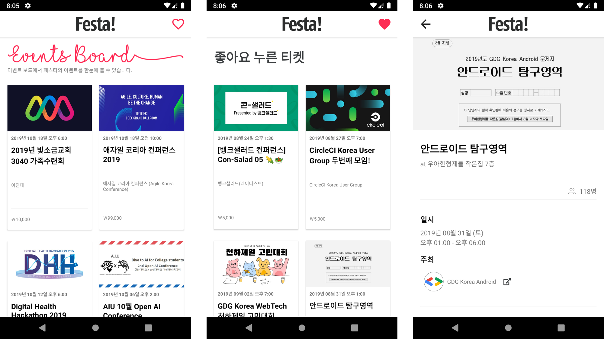
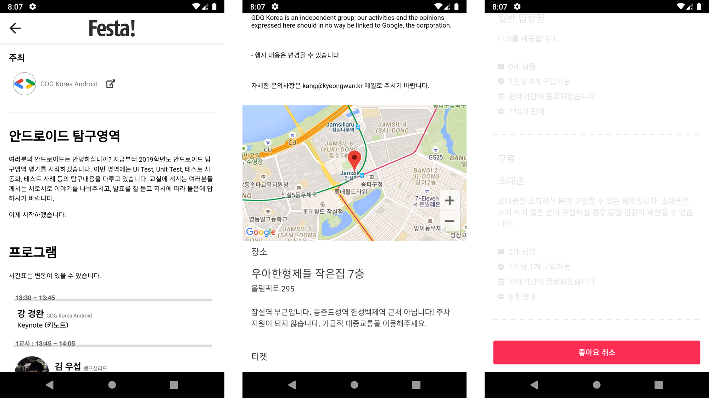
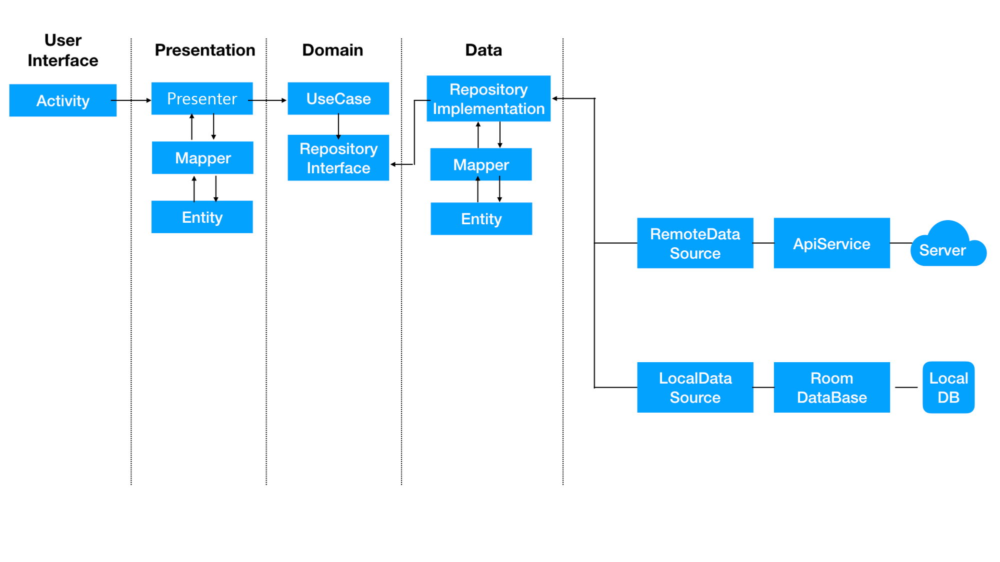

# Mini Festa

## ⚠ Warning

본 프로젝트가 접근하는 저작권은 실제 서비스를 담당하는 [**Festa**](https://festa.io) 에 있으며,  
이를 유료/상업적인 목적으로 이용 시 저작권 및 법적 책임이 발생할 수 있다는 점을 명시합니다.

## 📄 README

Festa 에 들어가 이벤트들을 확인하고는 싶은데,  
페이지까지 들어가기 귀찮은 사람들을 위해 만들어진 앱입니다.

### 🏆 Goal

**"이거 완전 Festa 아니냐ㅋㅋㅋ?"** 할 정도의 퀼리티  

### 📱 App Preview

#### Event Board

Festa 에 등록된 이벤트들과 자신이 좋아하는 이벤트들을 확인할 수 있습니다.  

#### Event Detail

이벤트의 상세 정보들을 볼 수 있습니다.  
***"좋아요"*** 버튼을 눌러 자신이 좋아하는 이벤트를 좋아요 목록에 추가 할 수 있습니다.

### 🎯 Architecture Approach

### 🚀 Things in use

**사용한 것들**

* Clean Architecture
* Dagger2
* RxJava2
* MVP Pattern
* Android JetPack's Room
* Butter Knife
* Retrofit2
* okhttp3
* Glide
* Google Maps API
